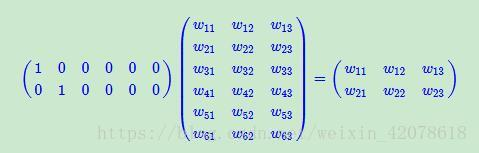

[TOC]

## Task01：赛题理解+Baseline（3天）

- 打卡截止：11月25日23:59
- 打卡链接：[https://shimo.im/forms/VnUXgcPtI5gO8KVH/fill 101](https://shimo.im/forms/VnUXgcPtI5gO8KVH/fill)
- 打卡结果：[https://shimo.im/sheets/aBAYVOmZLGfO6m3j/MODOC/ 43](https://shimo.im/sheets/aBAYVOmZLGfO6m3j/MODOC/)


### 一. 赛题理解

#### 1.首先我倒在了embedding上...

通过一篇博文搞懂了，附上链接： https://www.cnblogs.com/USTC-ZCC/p/11068791.html

下面是我的理解和总结

曾经用过one-hot编码，对文字量较少或只需要提取关键字的的数据来说很好用。

对于几千甚至上万字的文章来说使用one-hot编码：

第一需要构造的稀疏矩阵是很庞大的，第二无法体现词句之间的内在联系，所以并不合适使用one-hot编码。

embedding就解决了这两个问题：





两个矩阵通过相乘缩小了维度，embedding层的作用就是之一就是降维，它作为一个映射表存在。

另外embedding同样可以升维，矩阵的维度过小会导致特征过于笼统，过大会导致特征过于稀疏难以被发现，通过改变embedding使矩阵维度取合适的值，以便得到最好的的表达特征。

通过模型训练embedding层可以学习到词句之间的线性关系，如另近义词的矩阵相似

#### 2.赛题思路

使用基于物品的协同过滤算法，得到该用户点击过的文章的相似文章，按照相似读排序取最大的前五。

要求得到的是最后一次点击的文章，所以应使用时间特征，相似度按照时间和是否被同一用户点击用公式求得。


###　二．Ｂａｓｅｌｉｎｅ

####　１．代码复现

用ｖｉｒｔｕａｌｅｎｖ创建虚拟环境，安装第三方库．

代码修改，添加 import collections

修改数据文件名为data_raw,在同目录下建立tmp_results文件夹．

目录结构　

```shell
RecommandNews
├── data_raw
│   ├── articles.csv
│   ├── articles_emb.csv
│   ├── DataA1121.md
│   ├── sample_submit.csv
│   ├── testA_click_log.csv
│   └── train_click_log.csv
├── tmp_results
│   ├── itemcf_baseline_11-24.csv
│   └── itemcf_i2i_sim.pkl
└── 赛题理解+Baseline.ipynb

```


#### 2.代码关键函数理解（添加注释）

用于得到文章与文章之间的相似度，求相似度依靠的是点击时间和是否被同一用户点击

```python
def itemcf_sim(df):
    """
        文章与文章之间的相似性矩阵计算
        :param df: 数据表
        :item_created_time_dict:  文章创建时间的字典
        return : 文章与文章的相似性矩阵
        思路: 基于物品的协同过滤(详细请参考上一期推荐系统基础的组队学习)， 在多路召回部分会加上关联规则的召回策略
    """
    
    user_item_time_dict = get_user_item_time(df)
#     print(user_item_time_dict)
    
    # 计算物品相似度
    i2i_sim = {}
    item_cnt = defaultdict(int) # 当key不存在返回 int 默认值 0
#     print(item_cnt)
    for user, item_time_list in tqdm(user_item_time_dict.items()):
        # 在基于商品的协同过滤优化的时候可以考虑时间因素
        for i, i_click_time in item_time_list:
            item_cnt[i] += 1
            i2i_sim.setdefault(i, {})
            for j, j_click_time in item_time_list:
                if(i == j):
                    continue
                i2i_sim[i].setdefault(j, 0)
                
                i2i_sim[i][j] += 1 / math.log(len(item_time_list) + 1)　#按相关文章数量
                
    i2i_sim_ = i2i_sim.copy()
#     print(i2i_sim) #同一用户点击文章相似度
#     print(item_cnt) #某文章被点击次数
    for i, related_items in i2i_sim.items():
        for j, wij in related_items.items():
            i2i_sim_[i][j] = wij / math.sqrt(item_cnt[i] * item_cnt[j])
#     print(i2i_sim_) #按被点击次数处理得到的相似度矩阵
    # 将得到的相似性矩阵保存到本地
    pickle.dump(i2i_sim_, open(save_path + 'itemcf_i2i_sim.pkl', 'wb'))
    
    return i2i_sim_
```

根据每位用户点击过的文章，通过相似度矩阵得到相似的文章，按照相似度大小排序，不足给定数目则用热度最高的文章依次补全

```python
# 基于商品的召回i2i
def item_based_recommend(user_id, user_item_time_dict, i2i_sim, sim_item_topk, recall_item_num, item_topk_click):
    """
        基于文章协同过滤的召回
        :param user_id: 用户id
        :param user_item_time_dict: 字典, 根据点击时间获取用户的点击文章序列   {user1: {item1: time1, item2: time2..}...}
        :param i2i_sim: 字典，文章相似性矩阵
        :param sim_item_topk: 整数， 选择与当前文章最相似的前k篇文章
        :param recall_item_num: 整数， 最后的召回文章数量
        :param item_topk_click: 列表，点击次数最多的文章列表，用户召回补全        
        return: 召回的文章列表 {item1:score1, item2: score2...}
        注意: 基于物品的协同过滤(详细请参考上一期推荐系统基础的组队学习)， 在多路召回部分会加上关联规则的召回策略
    """
    
    # 获取用户历史交互的文章
    user_hist_items = user_item_time_dict[user_id]
#     print(user_hist_items)　#文章：时间
    item_rank = {}
    for loc, (i, click_time) in enumerate(user_hist_items):
#         print(i)
#         print(sorted(i2i_sim[i].items(), key=lambda x: x[1], reverse=True)[:sim_item_topk])
        for j, wij in sorted(i2i_sim[i].items(), key=lambda x: x[1], reverse=True)[:sim_item_topk]:
        #得到与某文章相似的所有文章，并按相似度排序，取前　sim_item_topk　个
            if j in user_hist_items:
                continue
                
            item_rank.setdefault(j, 0)
#             print(j,wij)
            item_rank[j] +=  wij # 有重复相似文章则相似度相加
#     print(item_rank)
    # 不足10个，用热门商品补全
    if len(item_rank) < recall_item_num:
        for i, item in enumerate(item_topk_click):
            if item in item_rank.items(): # 填充的item应该不在原来的列表中
                continue
            item_rank[item] = - i - 100 # 随便给个负数就行
            if len(item_rank) == recall_item_num:
                break
    
    item_rank = sorted(item_rank.items(), key=lambda x: x[1], reverse=True)[:recall_item_num]
#     print(item_rank)        
    return item_rank
```


