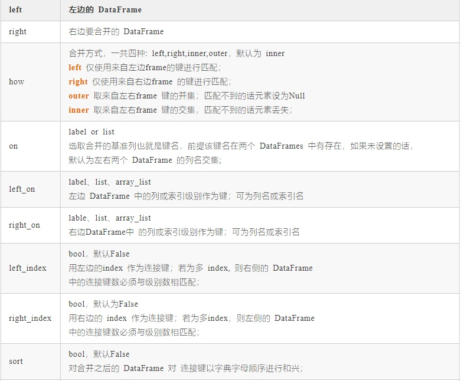
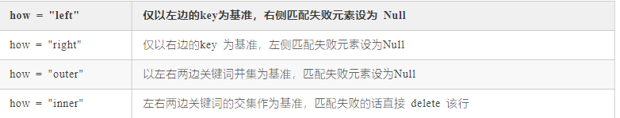
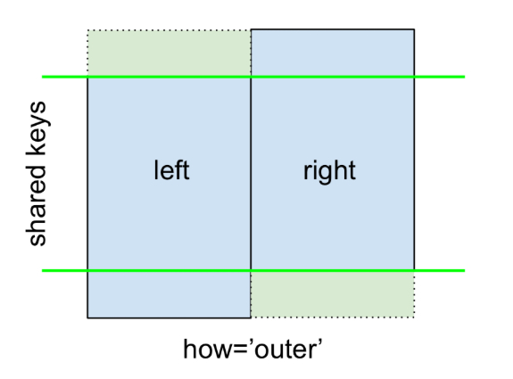

## Task02：数据分析（2天）

- 打卡截止：11月27日23:59
- 打卡链接：[https://shimo.im/forms/A2lqoXQA7dUFhfbf/fill 25](https://shimo.im/forms/A2lqoXQA7dUFhfbf/fill)
- 打卡结果：[https://shimo.im/sheets/9030MmGZo7ieOYqw/MODOC/ 17](https://shimo.im/sheets/9030MmGZo7ieOYqw/MODOC/)

### 一．数据分析代码及结果研究

可能是我对赛题及模型理解不到位，并没有什么感悟．．

后面有学习东西再添加（可耻的水了）

附上官方总结：

> 通过数据分析的过程， 我们目前可以得到以下几点重要的信息， 这个对于我们进行后面的特征制作和分析非常有帮助：
>
> 1. 训练集和测试集的用户id没有重复，也就是测试集里面的用户没有模型见过的
> 2. 训练集中用户最少的点击文章数是2， 而测试集里面用户最少的点击文章数是1
> 3. 用户对于文章存在重复点击的情况， 但这个都存在于训练集里面
> 4. 同一用户的点击环境存在不唯一的情况，后面做这部分特征的时候可以采用统计特征
> 5. 用户点击文章的次数有很大的区分度，后面可以根据这个制作衡量用户活跃度的特征
> 6. 文章被用户点击的次数也有很大的区分度，后面可以根据这个制作衡量文章热度的特征
> 7. 用户看的新闻，相关性是比较强的，所以往往我们判断用户是否对某篇文章感兴趣的时候， 在很大程度上会和他历史点击过的文章有关
> 8. 用户点击的文章字数有比较大的区别， 这个可以反映用户对于文章字数的区别
> 9. 用户点击过的文章主题也有很大的区别， 这个可以反映用户的主题偏好
> 10. 不同用户点击文章的时间差也会有所区别， 这个可以反映用户对于文章时效性的偏好
>
> 所以根据上面的一些分析，可以更好的帮助我们后面做好特征工程， 充分挖掘数据的隐含信息。

(第一条有错误，作出修改)

### 二.ｐａｎｄａｓ学习笔记

最近经常用到**pandas**，一些功能确实比较强，不懂就学，顺便做笔记．

#### １．基础了解

```python
import pandas as pd #导入

df = pd.read_csv(
    "path"，　 #通过地址导入csv，还可以是一个返回csv文件的URL
    encoding="utf-8"，	#设定编码方式
    sep="分割符"，	#设定分隔符
    header=0，	#选择第一行作为表头
    names=["namelist"],		#表头值
    dtype={"id": str}，	　#设定id列为字符串类型
           )

name = df["name"]	#返回指定列
name.head()	#只显示前面几行数据

df.rename(columns={'A':'a', 'B':'b', 'C':'c'})	#修改首行索引名
```
| a    | b    | c    |
| ---- | ---- | ---- |
| a    | 2    | 102  |
| b    | 8    | 98   |
| a    | 1    | 107  |
| c    | 4    | 104  |
| a    | 3    | 115  |
| c    | 2    | 87   |
| b    | 5    | 92   |
| c    | 9    | 123  |

#### 2.groupby

```python
df.groupby('c').mean()	#按ａ分组，并求均值
```

| a    | b    | c          |
| ---- | ---- | ---------- |
| a    | 2.0  | 108.000000 |
| b    | 6.5  | 95.000000  |
| c    | 5.0  | 104.666667 |

#### 3.rank

```python
DataFrame.rank(axis=0,method='average',numeric_only=None,na_option='keep',ascending=True,pct=False)
```

**axis**：设置沿着哪个轴计算排名（0或者1)

**numeric_only**：是否仅仅计算数字型的columns，布尔值

 **na_option**：NaN值是否参与排序及如何排序（‘keep’，‘top'，’bottom'）

 **ascending**：设定升序排还是降序排

 **pct**：是否以排名的百分比显示排名（所有排名与最大排名的百分比）

这里重点研究一下**method**参数 ：

在本小节的开头，介绍了排名问题中的三个一般情况，即顺序排名、跳跃排名、密集排名，在rank()函数可以通过设置method的值实现上述三种排名。

**method**：取值可以为'average'，'first'，'min'， 'max'，'dense'，这里重点介绍一下first、min、dense

**"first":** 顾名思义，第一个，谁出现的位置靠前，谁的排名靠前。

**"min":** 当method=“min”时，成绩相同的同学，取在**顺序排名**中最小的那个排名作为该值的排名。

**"dense"**: 是密集的意思，即相同成绩的同学排名相同，其他依次加1即可。

#### 4.transform

```
      a  b  c  d  e
li    1  2  3  4  5
chen  2  1  1  2  2
wang  1  2  3  4  5
zhao  2  1  1  2  2
qian  1  2  3  4  5
```

```python
key=['ss','kk','kk','ss','ss']  #给定index分组标记
print(data.groupby(key).mean())  #mean是按key做分组的列均值
```

```
           a         b         c         d    e
kk  1.500000  1.500000  2.000000  3.000000  3.5
ss  1.333333  1.666667  2.333333  3.333333  4.0
```

```python
print(data.groupby(key).transform(np.mean))
#data里每个位置元素取对应分组列的均值
```

```
             a         b         c         d    e
li    1.333333  1.666667  2.333333  3.333333  4.0
chen  1.500000  1.500000  2.000000  3.000000  3.5
wang  1.500000  1.500000  2.000000  3.000000  3.5
zhao  1.333333  1.666667  2.333333  3.333333  4.0
qian  1.333333  1.666667  2.333333  3.333333  4.0

结构与原表相同
```

#### 5.merge

```python
pandas.merge(left, right, how: str = 'inner', on=None, left_on=None, right_on=None, left_index: bool = False, right_index: bool = False, sort: bool = False, suffixes='_x', '_y', copy: bool = True, indicator: bool = False, validate=None)
```





左右 DataFrame 有相同 key 值时:**设置参数 on 实现两个DataFrame 的简单合并 **

```python
result = pd.merge(data1,data2,on = 'key')
```




**how= "left" 合并 **:以左边的 DataFrame 的 key 为基准，右边出现匹配失败的用 NaN 代替，出现多余 Key 表单所在的行部分直接被删除


- 图表解读：
- red : 表示所在行被剔除；
- blue ：代表所在行被保留；
- green : 表示误配的值用 NaNs 来代替；


**how ="inner"**:此合并方法在用的频率较高以左右两边 DataFrame 共有的 key 为基准，匹配成功的保留，匹配失败所在的行全部删除；


**how ="outer"**:与 how="inner" 用法对应，以左右两边 DataFrame 共有的 key 为基准，匹配成功的保留，匹配失败的键值以 Nan 进行替换；



#### 6.info和describe
info()函数用于打印DataFrame的简要摘要，显示有关DataFrame的信息，包括索引的数据类型dtype和列的数据类型dtype，非空值的数量和内存使用情况。

info()函数参数介绍

DataFrame.info **(self, verbose=None, buf=None, max_cols=None, memory_usage=None, null_counts=None)**

| Parameters                                       | Value                                                        |
| ------------------------------------------------ | ------------------------------------------------------------ |
| **self**                                         | self只有在类的方法中才会有，其他函数或方法是不必带self的。有关self的更多内容，指路→ \to→https://www.cnblogs.com/huangbiquan/p/7741016.html |
| **verbose**：bool, optional                      | “verbose”中文译为“冗长的”，该参数决定**是否打印完整的摘要**。如果为True，显示所有列的信息；如果为False，那么会省略一部分。**默认情况下，**遵循pandas.options.display.max_info_columns中的设置。 |
| **buf**：writable buffer, defaults to sys.stdout | 该参数决定**将输出发送到哪里**。**默认情况下，** 输出打印到sys.stdout。如果需要进一步处理输出，请传递可写缓冲区。可将DataFrame.info()存储为变量，指路→ \to→https://blog.csdn.net/qq_34105362/article/details/90056765。 |
| **max_col**：sint, optional                      | 该参数使得**从“详细输出”转换为“缩减输出”**，如果DataFrame的列数超过max_cols，则缩减输出。**默认情况下，** 使用pandas.options.display.max_info_columns中的设置。 |
| **memory_usage**：bool, str, optional            | 该参数决定**是否应显示DataFrame元素（包括索引）的总内存使用情况**。**默认情况下为True。** True始终显示内存使用情况；False永远不会显示内存使用情况。 |
| **null_counts**：bool, optional                  | 该参数决定**是否显示非空计数**。值为True始终显示计数，而值为False则不显示计数。**默认情况下，** 仅当Dataframe小于pandas.options.display.max_info_rows和pandas.options.display.max_info_columns时才显示。 |

```python
示例输出
<class 'pandas.core.frame.DataFrame'>
RangeIndex: 5 entries, 0 to 4
Data columns (total 3 columns):
int_col      5 non-null int64
text_col     5 non-null object
float_col    5 non-null float64
dtypes: float64(1), int64(1), object(1)
memory usage: 248.0+ bytes
```


describe()函数用于生成描述性统计信息。 描述性统计数据：数值类型的包括均值，标准差，最大值，最小值，分位数等；类别的包括个数，类别的数目，最高数量的类别及出现次数等；输出将根据提供的内容而有所不同。

describe()函数参数介绍

DataFrame.describe **(self: ~FrameOrSeries, percentiles=None, include=None, exclude=None)**

| 项目                                                         | Value                                                        |
| ------------------------------------------------------------ | ------------------------------------------------------------ |
| **percentiles**：list-like of numbers, optional              | 该参数决定**要包含在输出中的百分位数**。所有值都应介于0和1之间。**默认值**为[.25，.5，.75]，它返回第25、50和75个百分位数。 |
| **include**：‘all’, list-like of dtypes or None (default), optional | 该参数决定**要包含在结果中的数据类型的白名单**。‘all’：所有列将包含在输出中。 dtypes的列表：将结果限制为提供的数据类型。**默认情况下，** 结果将包括所有数字列。 |
| **exclude**：list-like of dtypes or None (default), optional, | 该参数决定**要从结果中忽略的数据类型的黑名单**。dtypes的列表：从结果中排除提供的数据类型。**默认情况下，** 结果将不排除任何内容。 |

```python
示例输出   
    numeric
count      3.0
mean       2.0
std        1.0
min        1.0
25%        1.5
50%        2.0
75%        2.5
max        3.0
```


#### 7.nunique和unique()

nuinque()这个函数分别统计每一列属性各自有多少个不同值。

```python
>>> import pandas as pd
>>> df=pd.DataFrame({'A':[1,2,3],
                     'B':[4,5,6]})
>>> df.nunique()
A    3
B    3
dtype: int64
>>> df=pd.DataFrame({'A':[1,1,2],
                     'B':[4,5,6]})
>>> df.nunique()
A    2
B    3
dtype: int64 
```

unique()是以 数组形式（numpy.ndarray）返回列的所有唯一值（特征的所有唯一值）

```python
>>>df['A'].unique()
[1,2]
```

