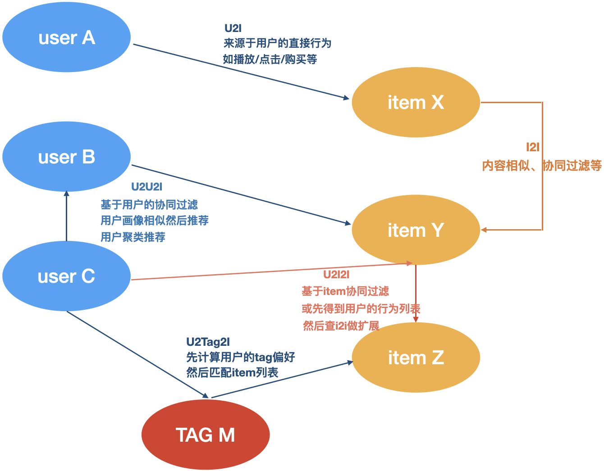

[TOC]

## Task03: 多路召回（3天）

- 打卡截止：11月30日23:59
- 开源内容：[Task03 天池新闻推荐入门赛之【多路召回】](http://datawhale.club/t/topic/198)
- 打卡链接：[https://shimo.im/forms/UgmuWIFIQ5oIJIze/fill 9](https://shimo.im/forms/UgmuWIFIQ5oIJIze/fill)
- 打卡结果：[https://shimo.im/sheets/KrkEVr5pRpSJvwAJ/MODOC/ 5](https://shimo.im/sheets/KrkEVr5pRpSJvwAJ/MODOC/)
### 多路召回理解

通过多种召回策略按一定权重组合得到最终结果

### 读取数据

在一般的rs比赛中读取数据部分主要分为三种模式， 不同的模式对应的不同的数据集：

1. debug模式： 这个的目的是帮助我们基于数据先搭建一个简易的baseline并跑通， 保证写的baseline代码没有什么问题。 由于推荐比赛的数据往往非常巨大， 如果一上来直接采用全部的数据进行分析，搭建baseline框架， 往往会带来时间和设备上的损耗， **所以这时候我们往往需要从海量数据的训练集中随机抽取一部分样本来进行调试(train_click_log_sample)**， 先跑通一个baseline。
2. 线下验证模式： 这个的目的是帮助我们在线下基于已有的训练集数据， 来选择好合适的模型和一些超参数。 **所以我们这一块只需要加载整个训练集(train_click_log)**， 然后把整个训练集再分成训练集和验证集。 训练集是模型的训练数据， 验证集部分帮助我们调整模型的参数和其他的一些超参数。
3. 线上模式： 我们用debug模式搭建起一个推荐系统比赛的baseline， 用线下验证模式选择好了模型和一些超参数， 这一部分就是真正的对于给定的测试集进行预测， 提交到线上， **所以这一块使用的训练数据集是全量的数据集(train_click_log+test_click_log)**

### Embedding召回的常见方法

在介绍Embedding召回方法之前先简单介绍一些常见名词概念，如：I2I、U2I、U2U2I、U2I2I、U2TAG2I，如下图所示，其中“2”代表的是下图中的边，“U”与“I”代表的事下图中的节点。

- I2I：计算item-item相似度，用于相似推荐、相关推荐、关联推荐；
- U2I：基于矩阵分解、协同过滤的结果、直接给u推荐i；
- U2U2I：基于用户的协同过滤，先找相似用户，再推荐相似用户喜欢的item；
- U2I2I：基于物品的协同过滤，先统计用户喜爱的物品，再推荐他喜欢的物品；
- U2TAG2I：基于标签的泛化推荐，先统计用户偏好的tag向量，然后匹配所有的item，这个tag一般是item的标签、分类、关键词等tag。

> 依据文章embedding相似度建立相似度矩阵

．．．

### YoutubeDNN

1. [重读Youtube深度学习推荐系统论文，字字珠玑，惊为神文](https://zhuanlan.zhihu.com/p/52169807)
2. [YouTube深度学习推荐系统的十大工程问题](https://zhuanlan.zhihu.com/p/52504407)

．．．

### 冷启动问题

1. https://zhuanlan.zhihu.com/p/52169807 (YouTubeDNN原理)
2. https://zhuanlan.zhihu.com/p/26306795 (Word2Vec知乎众赞文章) --- word2vec放到排序中的w2v的介绍部分

．．．